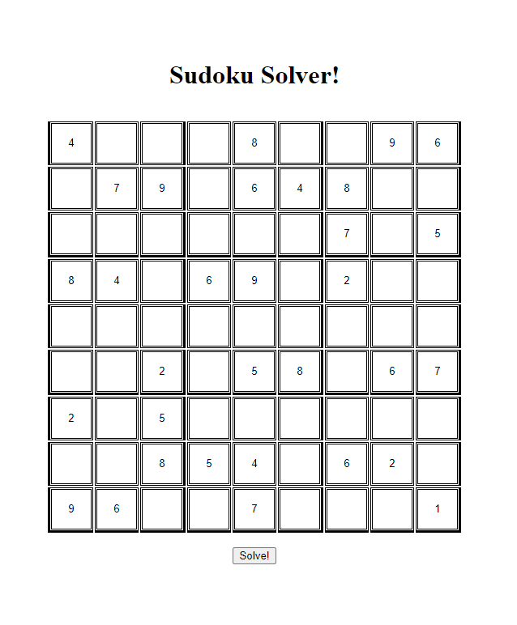
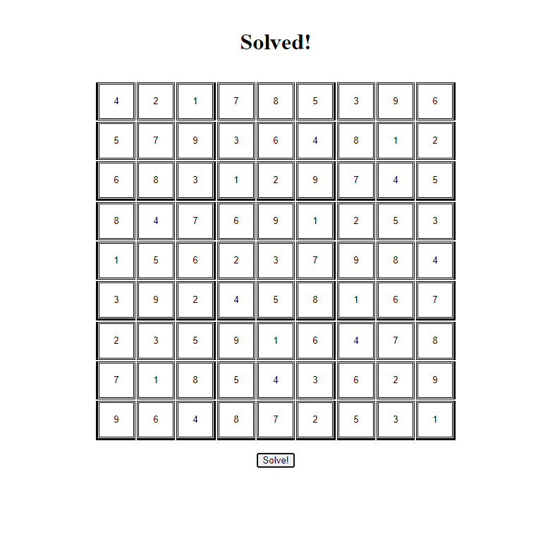
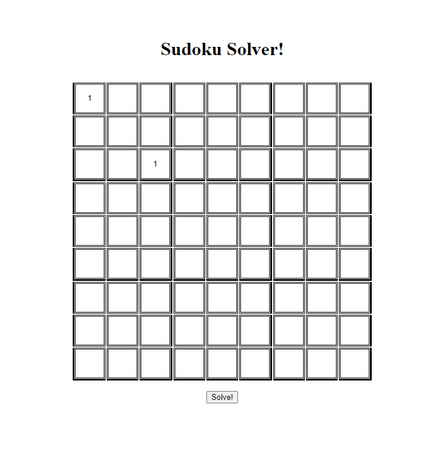
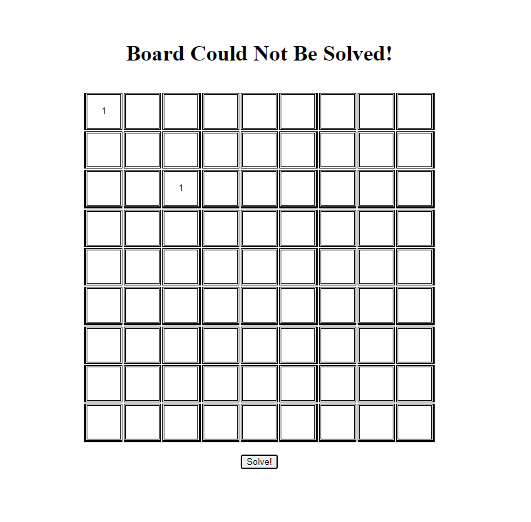

# Sudoku Solver Using HTML, CSS, and JavaScript!
## Created by Gabriela Santiago, owner of the GitHub repository

### This is a relatively simple sudoku solver program using HTML, CSS, and JavaScript. To use it, clone the repository and run the 'sudoku.html' file. It will prompt you to enter your sudoku puzzle, and upon selecting the 'Solve!' button, your puzzle will be solved!

## Entering the sudoku puzzle!
</img>

## Submitting and being shown the answers!
</img>

## Entering an invalid puzzle
</img>

## Error message for invalid puzzle
</img>

## Thank You Very Much For Reading!